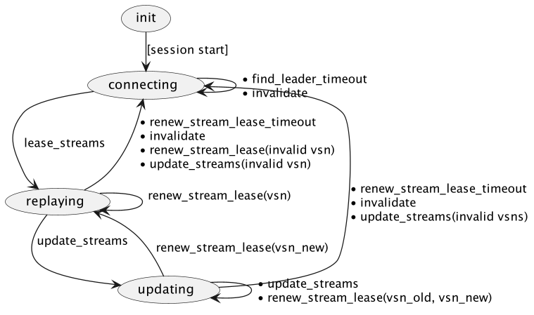

# Durable Shared Subscriptions

## Session side

### Session and Shared Subscription Handler interaction

Durable shared subscriptions work together with durable session implementations.

The Shared Subscription-related data structures are stored in the session but are
encapsulated and isolated from the rest of the session data structures with a  Shared Subscription Handler
facade module (`emqx_persistent_session_ds_shared_sub`). So, the Shared Subscription data
is opaque to the rest of the session code.

The Shared Subscription session handler is passive, i.e. it does not contain any running
processes. It only reacts to invocations from the session side.

A session is responsible for:
* Initializing the Shared Subscription Handler data on session bootstrap.
* Delivering Shared Sub-related messages (from timers, from other entities) to the Shared Sub handler.
* Forwarding subscribe/unsubscribe `$shares/group/...` requests to the Shared Sub handler.
* Querying stream states (`stream_state()`) for replay and reporting replay results to the Shared Sub handler.

The Shared Subscription Handler does not make any synchronous calls to external entities.


## Shared Subscription Handler

Shared Subscription Handler data is a collection of Group Subscription FSMs (GS FSM) identified by the group ID.

```erlang
#{GroupId => #{
    state => State,
    ...
}}
```

Each FSM contains the following states:
* `connecting` - the initial state, the FSM is looking for a Group Subscription Leader (GSL).
* `replaying` - the FSM is connected to the GSL and provides stream states for replay.
* `updating` - the FSM is connected to the GSL and is updating the set of streams.

### Group Subscription Leader (GSL)

The Group Subscription Leader (GSL) is a process that manages the stream states for the group. It is responsible for saving stream progress and distributing stream states across subscriber sessions.

Interaction with GSL is done via asynchronous messages. Messages from/to GSL may contain version(s) of the stream state set. If the version of the stream state set does not match the version of the FSM, the FSM should reset back to the `connecting` state.

### `connecting` state
In the `connecting` state, the FSM data is as follows:
* Topic(s)
* Subscription properties

FSM starts in the `connecting` state. On entering the state, the FSM sends a `find_leader` message to the local
Group Subscription Manager (GSM) to find the GSL for the group.

The GSM's responsibility is to find/spawn a cluster-unique GSL for the group and provide the subscriber's
`Pid` and other data to it. The GSL then provides the subscriber with the stream states and the replay starts.

#### Messages sent in `connecting` state

* `{find_leader, GroupId, Topic, ...}` - to the GSM to find the GSL for the group.

#### Messages handled in `connecting` state

* `{lease_streams, Version, ...}` — from the GSL with the stream states for replay. Version
* `find_leader_timeout` — self-scheduled timeout message, on which `find_leader` is resent to the GSM.

### `replaying` state

In the `replaying` state, the FSM data is as follows:
* Topic(s)
* Subscription properties
* Stream states, Version

In the `replaying` state, the FSM accepts replay requests from the session side and updates stream states after each replay interaction.

#### Messages handled in `replaying` state

* `{renew_stream_lease, Version, ...}` — from the GSL with the stream ids. If the version does not match the FSM's stream set version, it's an abnormal situation and the FSM goes back to the `connecting` state.
* `{update_streams, VersionOld, VersionNew, StreamsNew, ...}` — from the GSL with the updated stream set.
The message contains the old stream set version. If a mismatch is detected, the FSM goes back to the `connecting` state. Otherwise, the FSM records the new stream states, marks the old stream states as taken over and continues to `update_stream_states` state.
* `renew_stream_lease_timeout` — self-scheduled timeout message, canceled on each `renew_stream_lease` message. If the timeout occurs, the FSM goes back to the `connecting` state.
* `invalidate` — from the GSL if it considers the state of the FSM invalid. The FSM goes back to the `connecting` state.

#### Messages sent in `replaying` state

* `{update_stream_states, Version, SreamStates}` - to the GSL to update the stream states.

### `updating` state

In the `updating` state, the FSM data is as follows:

* Topic(s)
* Subscription properties
* Stream states, VersionNew
* Taken over stream states, VersionOld

In the `updating` state, the FSM accepts replay requests from the session side and updates stream states after each replay interaction. It also accepts replay _results_ for Taken Over streams.

#### Messages handled in `updating` state

* `{update_streams, VersionOld, VersionNew, StreamsNew, ...}` — from the GSL with the updated stream set. This update may continue to arrive unless the GSL is sure that the FSM is updating.
* `{renew_stream_lease, VersionOld, VersionNew, ...}` — from the GSL indicating confirmation of ongoing stream update.
* `{renew_stream_lease, VersionNew, ...}` — from the GSL indicating that it accepted the final updates of fully acked streams. These messages coincide with the one handled in the `replaying` state. On receive, the FSM goes back to the `replaying` state.
* `renew_stream_lease_timeout` — self-scheduled timeout message, canceled on each `renew_stream_lease` message. If the timeout occurs, the FSM goes back to the `connecting` state.
* `invalidate` — from the GSL if it considers the state of the FSM invalid. The FSM goes back to the `connecting` state.

#### Messages sent in `updating` state

* `{update_stream_states, VersionNew, StreamsNew, VersionOld, StreamsOld, ...}` - to the GSL to update the stream states. Both for active streams and for taken-over streams. If taken-over streams are fully acked, the according flag is sent for them.

### State transitions


